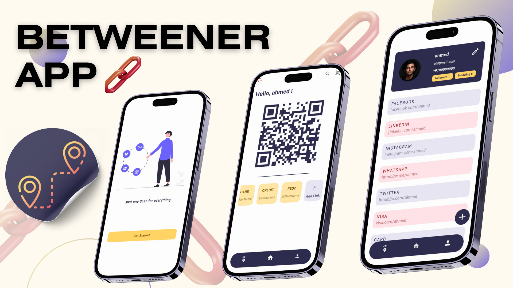
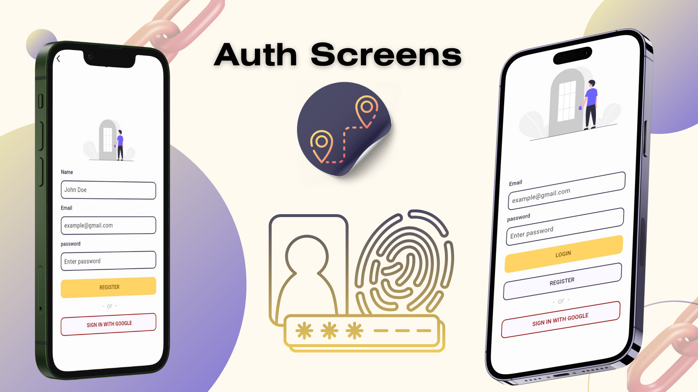
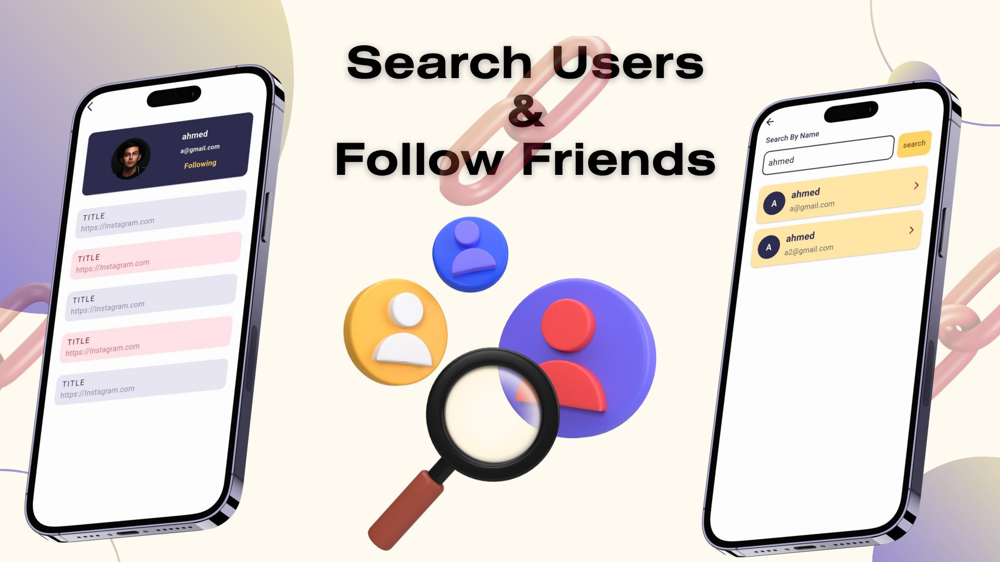

# 🔗 Betweener App

A modern and social Flutter application that allows users to create, manage, and share personal links through unique profiles and QR codes. Built for simplicity, speed, and seamless user interaction.

---

## 📌 Project Overview

**Betweener** is a cross-platform Flutter app that connects users through shareable profiles containing personalized links.  
It supports secure authentication, QR code generation, user following, and quick access to friends’ profiles — making link sharing fast, fun, and social.

Whether for professionals, content creators, or businesses, Betweener offers a lightweight and visually appealing way to manage your digital presence.

---

## 🛠️ Tech Stack

- **Flutter** – Cross-platform UI toolkit  
- **Dart** – Core programming language  
- **HTTP** – REST API communication  
- **Shared Preferences** – Local storage for tokens & user data  
- **QR Flutter** – QR code generation  
- **Email Validator** – User input validation  
- **Flutter SVG / Slidable** – Beautiful, interactive UI elements  

---

## 🧱 Architecture

The project follows a **modular and scalable architecture** ensuring clarity and maintainability:

- **Controllers:** Handle business logic and API communication (Auth, Links, User).  
- **Models:** Define data structures and handle JSON serialization.  
- **Core Helpers:** Manage constants, exceptions, shared preferences, and API base logic.  
- **Views (Features):** Organized screens for Onboarding, Authentication, Profile, Home, Search, and Links management.  
- **Assets:** Contains images and SVGs used throughout the UI.  

---

## ✨ Features

- 🔐 **User Authentication** – Register & login with secure API calls  
- 👤 **Profile Management** – View and customize user profile  
- 🌐 **Links Management** – Add, update, and delete links easily  
- 📸 **QR Code Generation** – Instantly share your profile via scannable QR  
- 🔎 **User Search** – Find and follow other users  
- 🤝 **Follow System** – View followers & following lists  
- 🚀 **Onboarding Flow** – Simple guided intro for new users  
- 💾 **Local Storage** – Persistent login and onboarding state  

---

## 🚀 How to Run the Project

1. **Clone the repository**  
- git clone https://github.com/a7med2002/betweener_app.git

2. **Install dependencies** 
- flutter pub get

3. **Run the app**
- flutter run

## 🖼️ Screenshots

## 🌐 Social Links
- 👨‍💻 Developer: [ِAhmed Meqdad]
- 📧 Email: [ahmd2002mqdad@gamil.com]
- 💼 LinkedIn: [linkedin.com/in/ahmed-meqdad](https://www.linkedin.com/in/ahmed-meqdad-3b756733b/)
